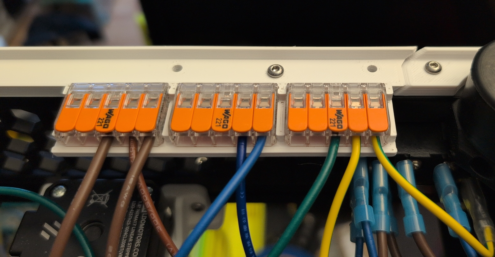
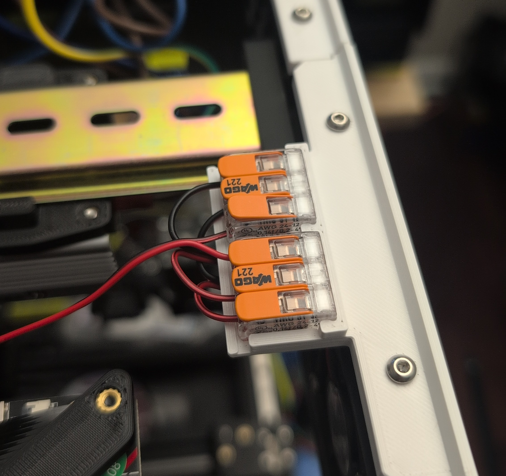

# Wago Accents

Modified versions of the rear and electronics bay fans accent parts allowing the use of Wago wire nuts.

**NOTE** The Wagos sit a bit proud of the accent pieces so be sure to use rubber feet that are at least 16mm tall so the printer doesn't rest on the Wagos.

